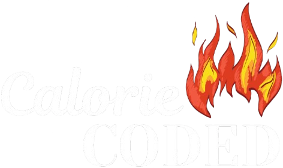

# Calorie Coded - Your Ultimate Calorie Tracker

## 🚀 About Calorie Coded
Calorie Coded is a powerful calorie tracking web application designed to help users efficiently manage their nutrition and fitness goals. It provides accurate calculations, meal recommendations, and progress tracking to make fitness journeys easier.

## 🔥 Features
- **Calorie Counter** – Track daily calorie intake.
- **Maintenance Calorie Calculator** – Find out how many calories you need to maintain weight.
- **Calorie Surplus/Deficit Calculator** – Adjust your intake based on weight, height, and age.
- **Advanced Accuracy** – Uses body measurements for precise calculations.
- **Macro Breakdown** – Get protein, carbs, and fats breakdown based on your goal.
- **AI-Powered Meal Suggestions** – Smart recommendations for hitting calorie/macro targets.
- **Food Database** – Easily search and log meals.
- **Progress Tracker** – Track weight, body fat %, and measurements over time.
- **Fat Percentage Calculator** – Estimate body fat percentage.

## 🛠️ Tech Stack
- **Frontend**: Html, CSS, JavaScript
- **Backend**: Node.js, Express.js  
- **Database**: MongoDB  

